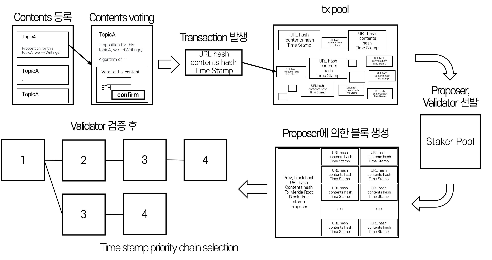
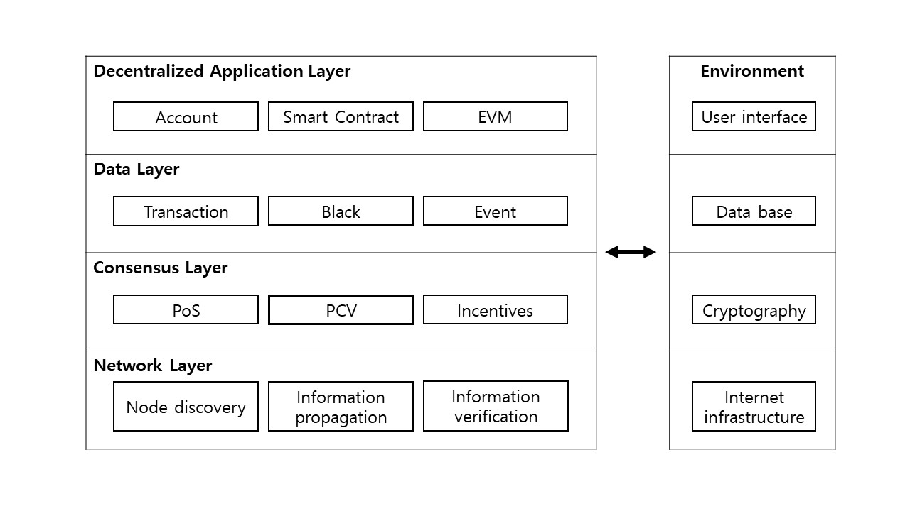

# PCV: PoS for Content Validation in Web3.0 Platform

## Awards
- **Best Paper Award** from the Korea Blockchain Society, 2022

## Overview
This research proposes PCV (PoS for Content Validation), a novel consensus algorithm based on Proof of Stake (PoS) designed to validate content authenticity in Web 3.0 Dapp platforms. Unlike traditional PoS systems where only large stakeholders participate in consensus, PCV enables direct democratic participation where any token holder can vote on content validity.

## System Architecture

*Figure 1: PCV System Architecture showing content verification workflow with transaction pools, validator selection, and block processing.*

## Platform Layer Structure

*Figure 2: Layered architecture of the blockchain platform including Decentralized Application Layer, Data Layer, Consensus Layer, and Network Layer with corresponding Environment components.*

## Authors
- **Gina Hong** (ghong@nexodim.com)
- **Jin Woo Jung** (kuntdari@korea.ac.kr)  
- **Hoh Peter In** (hoh_in@korea.ac.kr)
Department of Computer Science and Engineering, Korea University

## Key Features
### Direct Democracy Consensus
- Enables all token holders to participate in content validation voting
- Unlike traditional PoS: no minimum stake requirement (vs Ethereum's 32 ETH minimum)
- Implements true direct democracy rather than conditional democracy

### Nash Equilibrium Design
- Mathematically proven to reach Nash equilibrium when users vote for correct content
- Probability of collective correct decision increases with participant count
- Provides economic incentives for honest behavior

### Mathematical Foundation
The system's reliability is based on binomial distribution, where:

$$P\left(X \geq \left[\frac{N}{2}+1\right]\right) = \sum_{x=\left[\frac{N}{2}+1\right]}^{N} \binom{N}{x}a^x(1-a)^{N-x}$$

Where:
- P(X) represents the probability of the collective decision being correct
- N is the total number of voters
- a is the probability of an individual voter making the correct decision (assumed > 0.5)
- The formula shows that as the number of participants (N) increases, the probability of making the correct collective decision approaches 1

This mathematical framework ensures that when individual accuracy exceeds 0.5, the Nash equilibrium is achieved when voting honestly is the optimal strategy for all participants.

### Content Validation Process
1. Users submit content to Dapp
2. Token holders vote on content validity
3. Smart contracts process votes and transaction data
4. Beacon chain randomly selects proposer and validators
5. Blocks containing validated content are added to blockchain
6. Rewards distributed after 6-block confirmation

## Technical Architecture

### Core Components
- **Decentralized Application Layer**: User interface, smart contracts
- **Consensus Layer**: PoS mechanism with content validation
- **Network Layer**: Transaction pool, block propagation
- **Data Layer**: Blockchain storage with content metadata

### Security Features
- VRF (Verifiable Random Function) for validator selection
- Fork prevention with timestamp-based priority
- Slashing penalties for malicious behavior
- 6-confirmation requirement for reward distribution

## Advantages over Traditional Systems

1. **Democratic Participation**: All token holders can participate regardless of stake size
2. **Content Quality Assurance**: Community-driven validation ensures content authenticity
3. **Economic Incentives**: Rewards for correct voting, penalties for incorrect voting
4. **Decentralized Governance**: No central authority controlling content standards

## Future Work

- Expanding content scope to include subjective content
- Handling content validity changes over time
- Optimizing reward mechanisms for historical content validation
- Integration with existing Web 3.0 platforms

## Implementation Details

### Technologies Used
- Blockchain consensus algorithms (PoS variant)
- Smart contracts for voting logic
- Beacon chain for validator selection
- Cryptographic functions for security

### Mathematical Foundation
The system's reliability is based on binomial distribution, where:
- P(correct) increases as n (number of voters) increases
- Individual accuracy > 0.5 ensures collective accuracy approaches 1
- Nash equilibrium achieved when voting honestly is optimal strategy

## Publications

This research was published in:
- Conference proceedings (specific conference details in Korean)
- Supported by Korean government research grant (No.2021-0-00177)

## Contact

For questions or collaboration inquiries, please contact:
- Gina Hong: ghong@nexodim.com

---

*Note: This project demonstrates how blockchain technology can solve the problem of fake content in Web 2.0 environments through decentralized validation mechanisms.*
